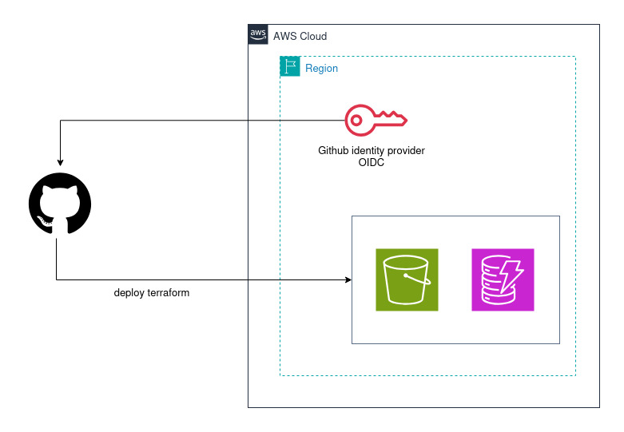

## Setting Up Remote Terraform Backend using Terraform

This repository contains Terraform configuration files to create a production-ready an AWS Remote Terraform State
Management with security as a first-class concern for team collaboration, state locking, and disaster recovery.

**Terraform state** is the source of truth for your infrastructure. By default, it lives in a local
```terraform.tfstate``` file, which works for learning but fails for teams. Remote state solves collaboration, security,
and reliability problems.

### Learning Objectives

***
By completing this project, you will learn:

- Understanding Managing Terraform State file - Local vs Remote
- Configuring Backend resource creation
- Creating state infrastructure
- State Locking with DynamoDB
- Monitor S3 bucket of Terraform State File and Lock Table
- Deploy State infrastructure
- Securely Manage Terraform State files
- Audit Terraform State changes
- State File Backup and Recovery - Automated Backup Strategy
- Migrating from Local to Remote State

### Why Remote State Matters

***
Local state has serious limitations:

- **No collaboration**: Team members overwrite each other's changes
- **No locking**: Concurrent applies corrupt state
- **No backup**: Laptop crashes lose infrastructure mapping
- **No security**: State contains sensitive values in plaintext

Remote state provides:

- **Shared access**: Teams work from the same state
- **Locking**: Prevent concurrent modifications
- **Versioning**: Roll back to previous states
- **Encryption**: Protect sensitive data at rest

### Architecture Overview

***



#### Architecture Details

***

- **GitHub (left)** The source of truth — your Terraform code lives here, and GitHub Actions triggers deployments.
- **GitHub Identity Provider (OIDC)** Instead of storing long-lived AWS credentials as GitHub secrets, GitHub
  authenticates to AWS using OpenID Connect (OIDC). GitHub presents a short-lived JWT token, and AWS validates it via
  the registered identity provider. No static keys needed.
- **S3 Bucket (green bucket icon)** Stores the Terraform state file (terraform.tfstate) remotely. This allows:
    - Team collaboration (shared state)
    - State locking coordination
    - History/versioning of infrastructure changes
- **DynamoDB Table (purple icon)** Handles state locking — prevents two Terraform runs from modifying state
  simultaneously, avoiding corruption.

#### Flow

- A push/PR triggers a GitHub Actions workflow
- The runner requests an OIDC token from GitHub
- AWS validates the token against the registered GitHub identity provider
- The runner assumes an IAM role (no static credentials!)
- Terraform accesses the S3 backend to read/write state
- DynamoDB locks the state during the operation

#### Why this pattern?

- No static credentials — OIDC tokens are short-lived and scoped
- Shared state — S3 enables team collaboration
- Safe concurrency — DynamoDB prevents state corruption
- Auditability — S3 versioning keeps state history
  This is considered the **best practice** for managing Terraform in a team/CI environment on AWS.

### Prerequisites

***
Before starting, ensure you have the following installed:

- AWS account with necessary permissions
- AWS CLI Installed and Configured with appropriate credentials
- Terraform >= 1.0 installed
- Create an OpenID Connect identity provider in Amazon IAM that has a trust relationship with this GitHub repository.
- Store the ```ARN``` of the ```IAM Role``` as a GitHub secret named ```AWS_ROLE_ARN``` which is referenced in the
  workflow files.

### Required AWS Permissions

***
Your AWS user/role needs permissions for:

- S3 (full access)
- DynamoDB (full access)
- KMS (full access)
- SNS (full access)
- CloudTrail (full access)
- CloudWatch (dashboard and metrics access)

### Implementation

***

- **Step 1: Project Structure**

```
remote-backend-setup/
└── modules/
    └── cloudtrail/                 # This module sets up an audit logging infrastructure
          ├── main.tf
          ├── outputs.tf
          └── variables.tf
    └── cloudwatch/                 # This module sets up a comprehensive monitoring and alerting system
          ├── main.tf
          ├── outputs.tf
          └── variables.tf
    └── dynamodb/                   # This module creates a DynamoDB table used to prevent concurrent Terraform runs from corrupting shared state.
          ├── main.tf
          ├── outputs.tf
          └── variables.tf
    └── iam/
          ├── bucket_policy.tf      # This code creates an S3 bucket policy for storing Terraform state files securely.
          ├── github_actions.tf     # This code sets up GitHub Actions CI/CD integration with AWS using OIDC (OpenID Connect)    
          ├── iam_cloudtrail.tf     # This code sets up AWS CloudTrail audit logging with proper IAM permissions and S3 storage
          ├── iam_replication.tf    # This code creates the IAM permissions needed for AWS S3 to automatically replicate objects from one bucket to another
          ├── outputs.tf          
          └── variables.tf         
    └── kms/                        # This module creates AWS KMS (Key Management Service) keys
          ├── main.tf
          ├── outputs.tf
          └── variables.tf
    └── s3/                         # This module sets up a secure S3-based backend for storing Terraform state files
          ├── outputs.tf
          ├── replication.tf
          ├── s3-state-file.tf
          └── variables.tf
    └── sns/                        # This module sets up an SNS (Simple Notification Service) notification system
          ├── main.tf
          ├── outputs.tf
          └── variables.tf
   ├── backend.tf                   # Backend configuration
   ├── data.tf                      # Data sources
   ├── locals.tf                    # locals for common_tags
   ├── main.tf                      # Main infrastructure resources
   ├── outputs.tf                   # Output values
   ├── dev-terraform.tfvars         # The terraform.tfvars file for dev
   ├── staging-terraform.tfvars     # The terraform.tfvars file for staging
   ├── prod-terraform.tfvars        # The terraform.tfvars file for prod
   ├── providers.tf                 # Terraform and AWS provider configuration
   └── variables.tf                 # Input variables and defaults
   ├── .github/workflows/
      ├── drift-detection.yml       # drift detection workflows
      ├── terraform-backend.yml     # backend workflows
      ├── terraform-checkov.yml     # checkov workflows
      ├── terraform-infracost.yml   # infracost workflows
      └── terraform-security.yml    # security workflows
```

- **Step 2 - S3 bucket for state files**
    - Prevent accidental deletion
    - Enable versioning to keep state history
    - Enable encryption
    - Block all public access (CRITICAL SECURITY)
    - Enable access logging on the state bucket
    - S3 bucket lifecycle Policy for Cost Optimization
    - S3 Event to SNS Notifications for ObjectCreated and ObjectRemoved
    - S3 Replication (for disaster recovery)
    - Cross-region state backup replication
    - Replicate encrypted objects

- **Step 3 - DynamoDB table for state locking**
    - Enable encryption
    - Prevent accidental deletion
    - Enable global table replication to the DR region

- **Step 4 - Security**
    - IAM Policies for State Access
    - KMS key for state encryption
    - Bucket Policy for Defense in Depth: enforce encryption in transit

- **Step 5 - SNS Topic for notifications/alerts on Terraform State**

- **Step 6 - CloudTrail for API-Level Auditing**
    - S3 bucket for audit logs with its own retention policy
    - Create a CloudTrail trail specifically for Terraform state auditing
    - Capture data events for the state bucket
    - Capture DynamoDB events for lock operations
    - Centralize Audit Logs: send CloudTrail events to CloudWatch Logs for centralized querying

- **Step 7 - CloudWatch Log group for Terraform state**<br>
  Set Up CloudWatch alert on Terraform state
    - Alert when Terraform locks are held too long
    - Alert when unusual Terraform state access detected
    - Alert when Terraform state is modified
    - Alert on state file access
    - Alert when more than 5 access over 5 minutes period
    - Alert when state backups are stale
    - Alarm when replication is failing
    - Alert when Terraform state replication is lagging
    - Multiple failed OIDC authentication attempts detected
    - Security Alerts

- **Step 8 - Configure the Backend (*backend.tf*)**

- **Step 9 - Deployment Workflow**
    - ```terraform-checkov.yml``` — Automated security scanning framework using Checkov to detect Terraform
      misconfigurations at both repository and pull request (PR) levels.
    - ```terraform-tflint.yml``` — TFLint automatically scans ```.tf``` files and reports potential issues. It works by
      analyzing Terraform code for stylistic errors, security problems, or provider-specific issues before deployment.
    - ```terrascan.yml``` — To scan Terraform code for security vulnerabilities.
    - ```tfsec-scanner.yml``` — Terraform workflow to catch security misconfigurations before they reach your cloud
      infrastructure.
    - 

### Why State Access Matters

***
The state file contains things you would not want exposed:

- Resource IDs and ARNs that map your infrastructure
- Database passwords and connection strings
- Private keys generated by the tls_private_key resource
- API keys passed to resources via variables
- Output values, including any marked as sensitive

### Why State Backups Matter

***
Without disaster recovery for Terraform state:

- Terraform cannot determine what needs to be created, updated, or destroyed.
- Running ```terraform plan``` will show every resource as "new."
- Manual cleanup of orphaned resources becomes necessary.
- Sensitive outputs and resource attributes are lost.
- A regional cloud outage makes your state inaccessible. You cannot run ```terraform plan``` or ```terraform apply```.
- Accidental deletion of the state file orphans all managed resources.
- State corruption from a failed migration or race condition blocks all operations.
- A compromised storage account could lead to state tampering.

### Audit Terraform State Changes

***
When something goes wrong with your infrastructure, one of the first questions is "what changed?" Auditing Terraform
state changes gives you a clear trail of who modified what and when. This is critical for compliance in regulated
industries, useful for debugging production issues, and important for security monitoring.

**What to Audit**

- **Who** made the change (user identity, CI/CD pipeline, service account).
- **When** the change happened (timestamp).
- **What** changed (which resources were added, modified, or removed).
- **How** the change was made (manual apply, CI/CD pipeline, state push).
- **Why** the change was made (linked to a PR, ticket, or change request).

### Best Practices

***

- **Enable encryption**: Always encrypt state at rest
- **Use IAM policies**: Restrict who can read/write state
- **Enable versioning on your backend bucket**. This is the bare minimum for any production setup. Versioning is the
  first line of defense against accidental deletion and corruption.
- **Block public access**: Never expose state publicly
- **Set up cross-region replication** for critical infrastructure state. Keep a copy of state in a different geographic
  region.
- **Monitor state file**: Enable CloudWatch Metric alarm and alerting
- **Audit access**: Enable CloudTrail logging for S3
- **Test your restore process** periodically. A backup you have never tested is a backup you cannot trust.
- **Monitor backup freshness** to catch failures early.
- **Keep backups for at least 30 days**. Some issues take time to surface.
- **Never store backups in the same location as the primary state**. A single point of failure defeats the purpose.
- **Replicate lock tables too**. Use DynamoDB global tables or equivalent so locking works during failover.
- **Test failover regularly**. Run DR drills weekly or monthly to verify your recovery procedure works.
- **Document the failover procedure** and store it somewhere accessible during an outage (not just in your primary
  region).
- **Monitor replication lag**. Stale replicas mean data loss during failover.
- **Keep backend configs for both regions** ready to go so failover is a single command.

### Migrating from Local to Remote State

***

- Initialize and deploy: First, create the state backend infrastructure and run it

```
$ terraform init
$ terraform plan
$ terraform apply
```

- Save outputs for later use

```
$ terraform output -json > backend-config.json
$ terraform output backend_config > backend-template.tf
```

- Backup this local state file

```
$ cp terraform.tfstate terraform.tfstate.backup
$ aws s3 cp terraform.tfstate s3://mycompany-terraform-state/bootstrap/terraform.tfstate
```

- Add or activate backend configuration(backend.tf)
- Reinitialize to migrate state: ```terraform init -migrate-state```
- Verify migration: ```terraform state list```
- Verify backend configuration: ```terraform show```
- Verify in S3: ```aws s3 ls s3://ce-dev-terraform-state-5bhkr8k3/dev/infrastructure/``` should show terraform.tfstate
- Remove local state (after verification!): ```rm terraform.tfstate terraform.tfstate.backup```
- Test that remote state works: ```terraform plan```should work normally, pulling from S3

### State Management Commands

***

- List all resources in state: ```terraform state list```
- Show details of a specific resource: ```terraform state show aws_instance.web```
- Pull remote state to local file for inspection: ```terraform state pull > state.json```
- Rename a resource in state: ```terraform state mv aws_instance.old aws_instance.new```
- Remove without destroying (resource still exists in cloud): ```terraform state rm aws_instance.web```

### Outputs

***
After successful deployment, the following outputs will be available:

- ```terraform_execution_role_arn``` - Terraform execution role ARN for GitHub Actions
- ```backend_config``` - Backend configuration to use in other projects

### Verification

***
After successful deployment, you can check your State File via AWS Management Console.
In this project, **Verification** directory contains ours resources created.

- **0-backend output.png** — Backend configuration to use in other projects and Terraform execution role ARN for GitHub
  Actions.
- **1-terraform init -migrate-state.png** — Reinitialization to migrate state
- **2-1-terraform-state migrated.png** — Terraform state migrate
- **2-s3 bucket.png** — List buckets created
- **3-s3 tf state.png** — S3 Bucket properties of Terraform state
- **4-s3 tf state replica.png** — S3 Bucket properties of Terraform state replicate
- **5-terraform-state-data-replica.png** — Terraform state replicate in us-west-2
- **6-dynamodb table us-east-1.png** — DynamoDB table in primary region
- **7-table: ce-dev-terraform-locks - Items returned.png** — Table items
- **8-dynamodb table in us-west-2.png** — DynamoDB table in secondary region
- **9-dynamodb Global tables.png** — DynamoDB Global tables replicas
- **10-KMS key.png** — KMS key in primary region
- **11-KMS key replica.png** — KMS key in secondary region
- **12-KMS key rotation.png** — KMS key rotation period
- **13-sns topic.png** — SNS Topic created
- **14-sns all subscription.png** — SNS Subscription created
- **15-s3-cloudtrail.png** — S3 CloudTrail for Terraform state file
- **16-cloudtrail.png** — CloudTrail for Terraform state file
- **17-cloudwatch log groups.png** — CloudWatch Log groups for CloudTrail log
- **18-Log groups ce-dev-terraform-state-file-trail.png** — Log group details of CloudTrail log
- **19-cloudwatch Alarms.png** — List of alarms created

### Cleanup

***
To delete all resources created, run ```$ terraform destroy -var-file="dev-terraform.tfvars" -auto-approve```. This will
delete all resources we have created.

### Contributing

***
This is a learning project. Feel free to:

- Report issues
- Suggest improvements
- Add features for practice

### License

***
This project is provided as-is for educational and production use.

***
**Important**: Always review and test this configuration in a non-production environment before deploying to production.
Customize S3, DynamoDB Table, replication, and other configuration settings according to your organization's
requirements.
